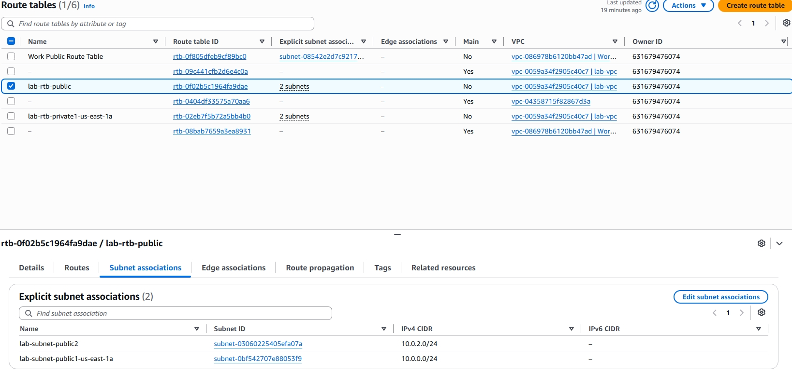

# AWS VPC and Web Server Lab

## Overview

 This AWS hands on lab demonstrates how
 I built and configured a custom
 network using Amazon VPC and launched
 an EC2 web server.

## Skills Practiced

 Amazon VPC
 - Public and private subnets
 - Availability Zones
 - Route tables
 - Internet Gateway
 - Nat Gateway
 - Security groups
 - Amazon EC2
 - HTTP web server configuration.

## Public Route Table Configuration

I created public subnets across two
Availability Zones and associated both
with the public route table. This
allows the public subnets to use the
same internet-facing routing
configuration.

